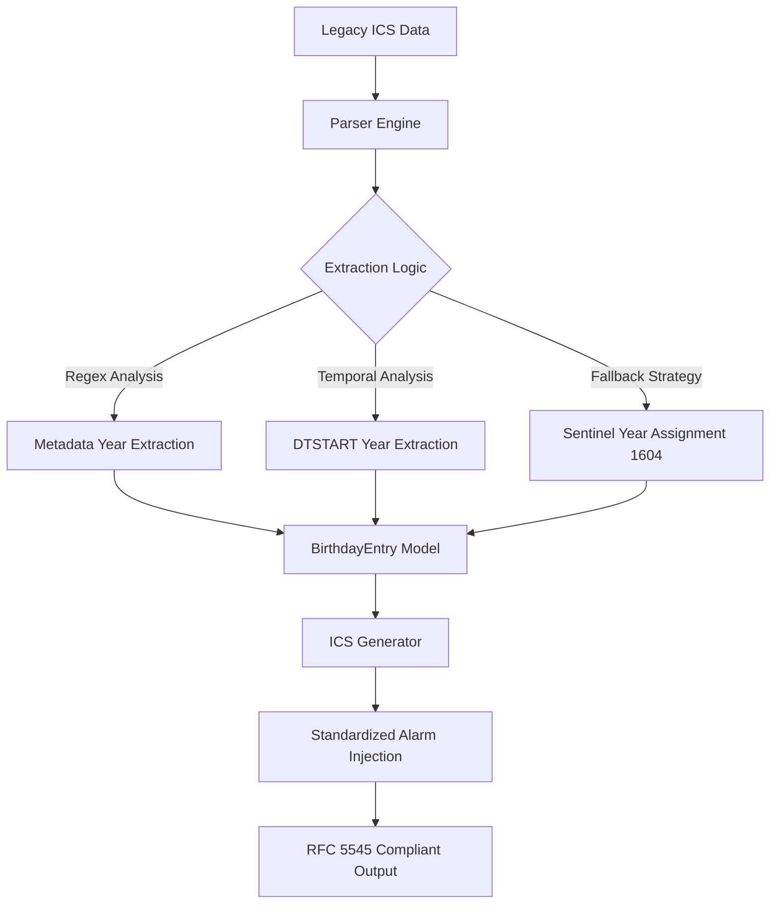

# ICS Birthday Harmonizer

The ICS Birthday Harmonizer is a Python-based utility designed to normalize inconsistent iCalendar (.ics) birthday records into a standardized, RFC 5545-compliant format.

The application implements a data transformation pipeline to ensure uniformity across all output entries, providing reliable alarm triggers and accurate birth year metadata extraction for modern calendar clients.

---

## Technical Architecture

The application utilizes a modular pipeline to process and harmonize event data:



### Strategic Implementation Details

- **Sentinel Year (1604):** To maintain calendar integrity for entries with unknown birth years, the system utilizes 1604 as a sentinel. This specific leap year ensures compatibility for February 29th birthdays while remaining sufficiently historical to be distinguished from validated data.
- **Harmonized Notification Trigger:** All events are injected with a `VALARM` component utilizing a `TRIGGER;RELATED=START:PT9H` property. This ensures a consistent notification at 09:00 local time on the day of the event.
- **UUID Integrity:** The generator replaces all legacy UIDs with fresh RFC 4122 UUID v4 identifiers to ensure global uniqueness and prevent record collision upon re-import.

---

## Directory Structure

The project follows a modular architecture to separate concerns between data parsing, internal modeling, and serialization:

```text
birthday-harmonizer/
├── data/               # Input and output directory for .ics files
├── src/
│   ├── config.py       # Global constants and logging configurations
│   ├── models.py       # Type-annotated internal data representations
│   ├── parser.py       # Logic for extraction from non-standard sources
│   ├── generator.py    # RFC 5545 compliant serialization logic
│   └── main.py         # Application orchestrator
├── requirements.txt    # Project dependencies
└── README.md           # Technical documentation
```

---

## Installation and Deployment

### 1. Environment Preparation

Initialize a Python 3.9+ environment and install the required dependencies:

```bash
python3 -m venv .venv
source .venv/bin/activate
pip install -r requirements.txt
```

### 2. Data Preparation

The application expects a source file located at `data/input.ics`. Ensure the source file is present before execution.

### 3. Execution

Run the application as a module from the project root to ensure correct package resolution:

```bash
python3 -m src.main
```

### 4. Verification

Upon successful execution, the normalized file will be available at `data/output.ics`. This file is ready for import into any standards-compliant calendar application (e.g., Google Calendar, Apple Calendar, Microsoft Outlook).

---

## Standards Compliance

- **RFC 5545:** The output is strictly validated against the Internet Calendaring and Scheduling Core Object Specification.
- **Transparency:** All events are marked as `TRANSPARENT` to prevent the modification of user availability.
- **Recurrence:** Complex `BYMONTH` rules are deprecated in favor of simplified `FREQ=YEARLY` recurrence based on the `DTSTART` property.
